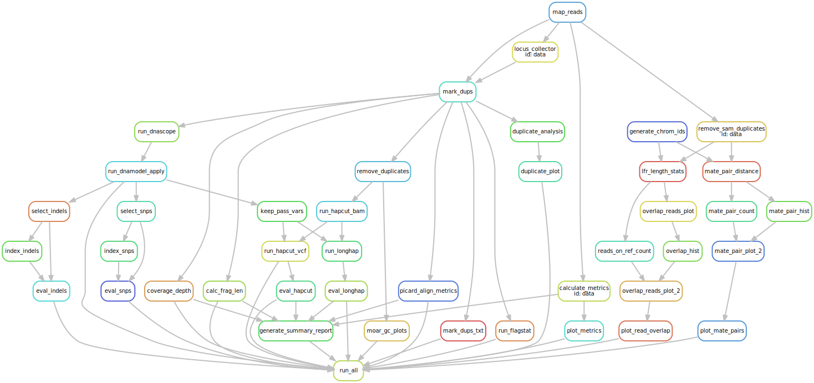

## CGI Pipeline 

This pipeline is for various CGI DNA sequencing applications. 
The config file has various modules with booleans that can be turned on or off.
Scripts, tools and binaries are under Data\_and\_Tools/tools, 
whereas Data\_and\_Tools/data (not on github) contains various databases and large datafiles.

## Workflow

## Directory Structure

The pipeline is organized as follows:

- Data\_and\_Tools
    - Data
        - Contains some datasets used by the pipeline
    - Tools
        - Contains many tools and scripts used by the pipeline
        - Includes tools to validate or evaluate results
    - barcode.list
        - a file of valid barcodes
    - barcode\_RC.list
        - a file of valid reverse complemented barcodes
    - bash\_profile
        - a bash profile to set up the execution environment
- Rule\_Testing\_Scripts
    - Calc\_Frag\_Len\_Tests
        - Contains `calc_frag_test.py` to test the fragment calculation script after changes
        - Also contains some extra files to setup the tests
    - Split\_Read\_Snakefile\_Tests
        - Contains `split_reads_test.py` to test the read splitting script after changes
    - Test\_Files
        - Contains files necessary for the testing scripts
        - 1000count
            - Contains fastq files with 1000 reads for `split_reads_test.py`
        - hg001.sort.rmdup.bam
            - a bam file for `calc_frag_test.py`
        - hg001.sort.rmdup.bam.bai
- Snakefiles
    - See snakefile comments for more info
    - run.all.snakefile
        - This contains all the setup snakemake code to execute the pipeline
        - It defines the `run_all` rule used to determine what steps will be executed
    - splitreads.snakefile
        - Rules for identifying fastq files, determining barcodes, determining barcode length and splitting reads
    - stlfr.main.snakefile
        - Rules for mapping reads and marking duplicates
    - make\_vcf.snakefile
        - Rules for variant calling, filtering models, and benchmarking variants
        - Also includes some steps for pre-filtering variants for phasing
    - phasing.snakefile
        - Rules for running hapcut and longhap
        - Also includes rules for evaluating their output
    - metrics.snakefile
        - Rules for evaluating library quality and gathering metrics
        - These include insert size metrics, duplicate analyses, flagstat, coverage
        - Also includes the summary generation rule
    - calc\_frag\_len.snakefile
        - Rules for doing fragment size calculations
        - Also includes a rule for some phasing evaluations
    - remove\_sam\_analysis.snakefile
        - This file has a lot of rules for secondary analyses held over from the previous pipeline
        - They're rarely looked at and therefore infrequently run
        - Includes mate pair distance evaluation, as well as read overlap plots
- Test\_Dir
    - These are mostly deprecated
    - WGS\_Test
        - Previously used this directory to test config files for WGS analyses
    - smLFR\_Test
        - Previosuly used this directory to test config files and rules for smLFR analyses
    - The pipeline has been streamlined to handle both of these use cases without changing config parameters
    - If the pipeline undergoes major changes, organizing SSBC files under WGS\_Test could be useful to make sure that runs go smoothly
- config.yaml
    - More info in config comments as well as below
    - This file contains all parameters that could be changed to alter the desired output
    - Also contains paths for executables for updating tools
    - Sample details should be modified here as well
    - Has details for thread allowances to particular rules
    - This file should be copied and edited within the analysis directory for the sample
- run\_snakemake.sh
    - More info in script comments
    - This file should be copied and edited within the analysis directory for the sample
    - It's set up to e-mail a user when execution is completed
    - Also sets the overall number of threads useable
        - Recommend 20-25 for small samples
        - As many as feasible for larger samples, or samples you want to variant call
- request\_design.md
    - details my thoughts on how one might approach a fully hands off tool, where lab folks request analysis
- wgs\_pipeline
    - executabel with preliminary steps for implementing the request design by calling snakemake as a module within python
    - pyyaml could be used to alter a template config to fit user submitted parameters

## Running the pipeline

Most fastq files are stored at `/research/rv-02/Projects/Project_stLFR/`.
Analyses are run at `/research/rv-02/Projects/Project_stLFR/pipeline_analysis/`.
Within `pipeline_analysis/` directories are organized by slide and lanes pertinent to any given samples.
For example, four samples are sequenced on two slides, such that LaneN of both slides contain the same sample.
These will be found under `pipeline_analysis/` as `slide1_slide2/`, within which will be subdirectories `slide1_lane1_slide2_lane1/`, `slide1_lane2_slide2_lane2/`, etc. 

Within any given sample analysis directory will be a `fastq/` directory and one or more analysis directories.
The analysis directory for WGS analysis are typically `stLFR_Analysis` or `Pipeline_Analysis`.
Within the fastq directory, the directory containing the appropriate lanes fastq information are symlinked as `slideN_laneN/`.
For example, the  directory `/research/rv-02/Projects/Project_stLFR/pipeline_analysis/slide1_slide2/slide1_lane1_slide2_lane1/fastq/` would contain two subdirectories, `slide1_lane1` and `slide2_lane1`.
These would point to `/research/rv-02/Projects/Project_stLFR/slide1/lane1` and `/research/rv-02/Projects/Project_stLFR/slide2/lane1` respectively.

On the same level as `fastq/` you'll typically find `stLFR_Analysis/`.
The `config.yaml` file, as well as `run_snakemake.sh` should be copied to within `stLFR_Analysis`.
At this point, all that's needed is to modify `config.yaml` and `run_snakemake.sh` appropriately, then start the execution of the pipeline by running `bash run_snakemake.sh`.

## Modifying config.yaml

There are lots of parameters in the config file. This provides an overview of some of the more important parameters.

- samples
    - fastq: `[data/split_read.1.fq.gz, data/split_read.2.fq.gz]`
        - This shouldn't need to be changed
        - It's the path to split fastqs
        - If you already have split fastqs, you can generate the `data/` directory and link the split fqs within
        - You can then run the pipeline without any modification
    - fq\_path: `../fastq`
        - This is the path at which unsplit fastqs reside
        - If the directory is setup as above you shouldn't need to change anything
        - However, if you want to use fastqs from a different location you can specify a path
        - __Note__ the specified directory will still need to contain directories for the lanes specified, formatted the same
    - lanes: `[V3000NNNNN_L0N]`
        - This is a list of all lanes for the sample
        - If you add multiple lanes to the `fastq/` directory but don't add them to the config, they won't be used
        - Alternate formatting could be applied
    - id: `data`
        - This is the name that will be used for the samples and serves as a wildcard for generating the output specified by `run_all`
        - Typically I rename this to `slide_1_lane_1_slide2_lane2` or to mirror whatever the directory containing `fastq/` and `stLFR_analysis/` is named
    - chroms: `[list, of chroms]`
        - Shouldn't be modified for human samples
        - Contains all chromosomes that will be evaluated for fragment length calculations
        - The pipeline will scrape the `fasta.fai` file if no chromosomes are supplied
        - If you're using a de novo assembly as your reference, leave the list or entry empty
- modules
    - stLFR: `True`
        - True if you want stLFR specific calculations done
        - False if you're running a non-stLFR WGS library
    - variant\_calling: `False`
        - True to generate a VCF
    - benchmarking: `False`
        - True to evaluate the output VCF against benchmark truthsets
        - Be sure to modify the truthsets within the config file if `True`
    - phasing: `False`
        - True to run hapcut and longhap and evaluate phasing results
        - Don't run with smLFR samples
    - mate\_pair\_analysis: `False`
        - This is one of the modules mentioned above within `remove\_sam\_analysis` and likely won't ever be run
    - read\_overlap\_analysis: `False`
        - Same as above
    - duplicate\_plot: `False`
        - Same as above
    - umi\_analysis: `False`
        - True if you're going to be working with UMI
        - Further rules for UMI analysis could be added to the pipeline and summary report
- params
    - ref\_fa: `/path/to/hg38/or/other.fa`
        - This is the path to the reference for the sample
        - Modify as appropriate
    - read\_len: `100`
        - Read length of the sample, not including barcode
        - Modify appropriately
    - sentieon\_install: `/path/to/install/root`
        - This is the path to the newest sentieon install and should be updated when new releases are available
    - Other parameters won't have to modified regularly
- benchmark
    - benchmark\_snp: `/path/to/the/appropriate/snp/callset.vcf.gz`
        - should only have to be modified if you're benchmarking a sample that isn't HG001
    - benchmark\_indel: `/path/to/the/appropriate/indel/callset.vcf.gz`
    - bedfile: `/path/to/high/confidence/bedfile.bed`
    - all of the above are organizes under `/research/rv-02/home/eanderson/Resources_And_DBs/hg38_GIAB/HG00N/files`
    - ref\_sdf: `/path/to/ref.sdf`
        - Should only need to be changed when the reference changes and you're doing benchmarking
    - truth\_vcf\_dir:
        - This one is a little complicated
        - Only set this directory if you're phasing a benchmarked sample
        - This needs to be blank if you're phasing an unknown sample
        - The pipeline contains logic for evaluating phasing of unknown samples as well as known samples
        - An example directory is below, however these VCFs are from hg19, not hg38
            - `/home/ysun/GIAB_VCF/`
        - You can generate these directories yourself by splitting the truth VCFs by chromosome into a directory and supplying the directory path
- threads
    - These are various tools used by the pipeline
    - Specify the threads as you feel is appropriate
    - If you give the main snakemake command (run\_snakemake.sh) fewer threads, all tools will be capped at that number

